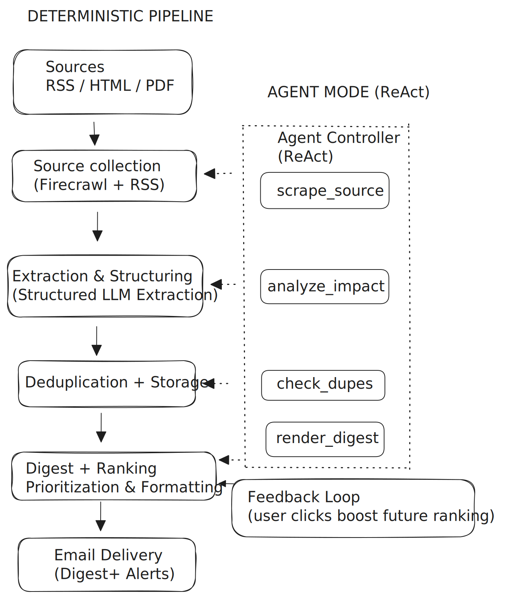

# Financial Services Trend Monitor

> Agentic AI system that converts regulatory and fintech signals into prioritized executive briefings.

---

## Overview

Monitors financial services intelligence sources — regulatory bodies and payments infrastructure — and converts unstructured developments into prioritized strategic briefings.

Designed to demonstrate how agentic architectures can reduce research latency and improve signal prioritization in advisory and financial services environments.

---

## Architecture

Hybrid system combining deterministic processing with agentic orchestration.

**Deterministic pipeline**  
Sources → Collection → LLM Extraction → Deduplication → Digest → Email

**Agent controller (ReAct)**  
Dynamically orchestrates pipeline tools:

- `scrape_source` → Collection  
- `analyze_impact` → Extraction  
- `check_dupes` → Storage  
- `render_digest` → Digest  

**Feedback loop**  
Recipient relevance signals feed back into future ranking.

---

## Key Design Decisions

- Hybrid agent + pipeline architecture  
- Structured LLM extraction (typed schemas)  
- Two-tier deduplication (URL normalization + content hash)  
- Append-only storage for auditability  
- Feedback-weighted ranking  
- Constrained agent action space  

---

## Guardrails & Safety

- Agent step + timeout limits  
- Source domain allowlist enforcement  
- PII-safe feedback logging  
- Idempotent relevance storage  
- Environment-based secret handling  

---

## Tech Stack

**LLM / Agent**  
OpenAI · ReAct controller  

**Backend**  
Python · FastAPI  

**Data**  
Pydantic · JSONL storage  

**Collection**  
Firecrawl · RSS ingestion  

**Delivery**  
SMTP email  

**Testing**  
pytest (agent + pipeline + feedback)
